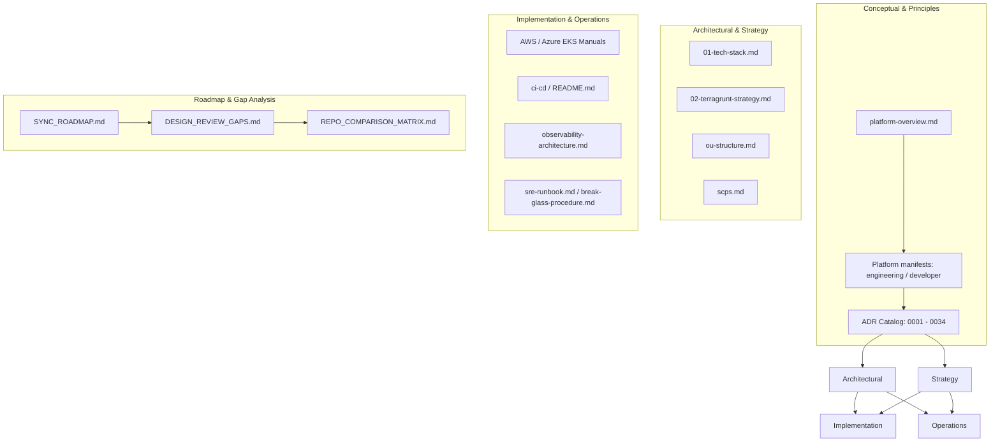

# Platform Documentation Audit and Evaluation Report (June 2026)

This document provides a comprehensive evaluation of the platform-design repository's documentation structure, content accuracy, and alignment (up-to-dateness) with the implemented infrastructure codebase in June 2026.

---

## 1. Documentation Structure Assessment

The documentation in `platform-design` is organized into a highly structured, layered topology that effectively maps to the technical layers of the platform:

### Strengths of the Structure:
1. **Strong Rationale Traceability:** Decisions are codified in Architecture Decision Records (ADRs) under `docs/adrs/`, numbered sequentially. This prevents "tribal knowledge" and gives historical context to why specific tools (e.g., Karpenter, Cilium, Kyverno) were chosen.
2. **Clear Separation of Concerns:**
   * The **Engineering Manifest** defines platform architecture layers and processes for the platform team.
   * The **Developer Manifest** acts as a contract/SLA for application consumers.
   * **Runbooks** focus on operational incidents, failover, and disaster recovery.
3. **Multi-Source Alignment:** The presence of `SYNC_ROADMAP.md` and `REPO_COMPARISON_MATRIX.md` shows a disciplined process for tracking drift between the upstream landing zone (`project/infra`) and the local repository.

---

## 2. Document-to-Code Alignment (Up-to-Dateness Audit)

Since the original audit in early 2026, the codebase has undergone significant modernization. Below is the current synchronization matrix between what is documented vs. what is implemented:

### 2.1 Fully Synced Components
The following core capabilities are successfully implemented in code and fully documented via ADRs/manuals:

| Capability | Document Reference | Code / Implementation Status |
|---|---|---|
| **EKS v1.35 & Node OS** | [ADR-0030](adrs/0030-bottlerocket-node-os.md) | **Synced.** EKS cluster variable default is set to `1.35`, and Karpenter `EC2NodeClass` templates use `Bottlerocket` as the default AMI family. |
| **Cilium v1.19.2 CNI** | [ADR-0003](adrs/0003-cilium-over-aws-vpc-cni.md) | **Synced.** Cilium upgraded to `1.19.2` with Hubble observability and network policies active. |
| **External Secrets (ESO)** | [ADR-0008](adrs/0008-external-secrets-operator.md), [ADR-0031](adrs/0031-secret-rotation.md) | **Synced.** Upgraded to `2.2.0` (using `v1` API resources) with automated secret rotation via Secrets Manager + Lambda. |
| **EKS Pod Identity** | [ADR-0018](adrs/0018-eks-pod-identity-as-default-workload-identity.md) | **Synced.** Deployed for core controller pods (ESO, EBS CSI, LB controller, Loki, Thanos) via dedicated Terragrunt units. |
| **IAM & Account Baselines** | [ADR-0017](adrs/0017-resource-side-perimeter-and-declarative-org-controls.md) | **Synced.** IAM Access Analyzer, S3 Account Public Access Block, and EBS Encryption by Default are enabled. SCPs (`DenyAllSuspended`) and Suspended OU are set up. |
| **OIDC Auth for CI/CD** | [ADR-0016](adrs/0016-tier1-supply-chain-hardening.md) | **Synced.** GitHub OIDC provider is configured to run keyless CI plan/apply stages without static credentials. |
| **Observability (LGTM)** | [ADR-0026](adrs/0026-observability-target-architecture.md) | **Synced.** LGTM Stack (Prometheus 3.x + Thanos Object Storage, Loki 3.x, Tempo traces via eBPF Beyla, Grafana Alloy) is fully deployed. |
| **Unified Tagging** | [ADR-0028](adrs/0028-unified-platform-tagging-and-labeling-taxonomy.md) | **Synced.** Standardized tags (`platform:system`, `platform:component`, `platform:env`, `platform:owner`, `platform:managed-by`) are globally applied across Terragrunt and Kubernetes. |

### 2.2 Out-of-Sync / Legacy References (Drift)
Several documentation files still contain legacy recommendations or outdated versions from previous phases:

1. **Azure/AKS Manual Drift (`docs/azure.md` & `docs/eks-cilium-istio-karpenter-cdk-manual.md`):**
   * **Issue:** These files reference deprecated Karpenter `v1beta1` APIs (`apiVersion: karpenter.sh/v1beta1` and `kind: Provisioner`). Karpenter has been updated to `v1` (with `NodePool` and `EC2NodeClass`).
   * **Issue:** Outdated Kubernetes version references (e.g. AKS `1.28.3` vs latest `1.31`).
   * **Issue:** Outdated host OS (references Ubuntu `18.04-LTS` which is End-of-Life, whereas it should be `22.04` or `24.04`).
2. **Elasticsearch / Loki Ambiguity (`docs/observability-architecture.md`):**
   * **Issue:** The architecture document retains sections referencing Elasticsearch and Lucene index sizes, despite the platform standardizing on Grafana Loki (using LogQL and Grafana Alloy shippers).
3. **Service Mesh Ambiguity:**
   * **Issue:** `docs/platform-overview.md` and `docs/01-tech-stack.md` describe Istio and Linkerd as "optional" or "planned", failing to reflect that Cilium Gateway API ([ADR-0009](adrs/0009-cilium-gateway-api-ingress.md)) and Envoy Gateway ([ADR-0025](adrs/0025-envoy-gateway-secondary-l7.md)) have been fully adopted as the primary ingress/gateway layers.
4. **Control Tower vs. Flat Organizations (`docs/ou-structure.md`):**
   * **Issue:** The documentation outlines a full 9-account Control Tower hierarchy (including dedicated Log Archive and Security accounts), but the repository uses a simplified 6-account flat Organizations layout.

---

## 3. General Health and Recommendations

To maintain documentation integrity and avoid cognitive load for onboarding platform engineers:

### Recommendation 1: Deprecate or Clean Up Azure References
If the platform focuses strictly on AWS (as indicated by Terragrunt/EKS implementation), `docs/azure.md` should be marked as **Legacy / Archived** or updated to align with Karpenter v1 APIs.

### Recommendation 2: Consolidate Observability Guides
Remove references to Elasticsearch from `observability-architecture.md` and explicitly declare Grafana Loki as the sole logging standard.

### Recommendation 3: Align Service Mesh Mentions
Update the tech stack documents to highlight Cilium Gateway API and Envoy Gateway as the official solutions, and clarify the deprecation/exclusion of Istio.

### Recommendation 4: Sync the ROADMAP and Gaps Files
Update `docs/DESIGN_REVIEW_GAPS.md` and `docs/SYNC_ROADMAP.md` to mark Phase 1 (Security) and Phase 2 (Upgrades) as **100% Completed** in the summary metrics.
