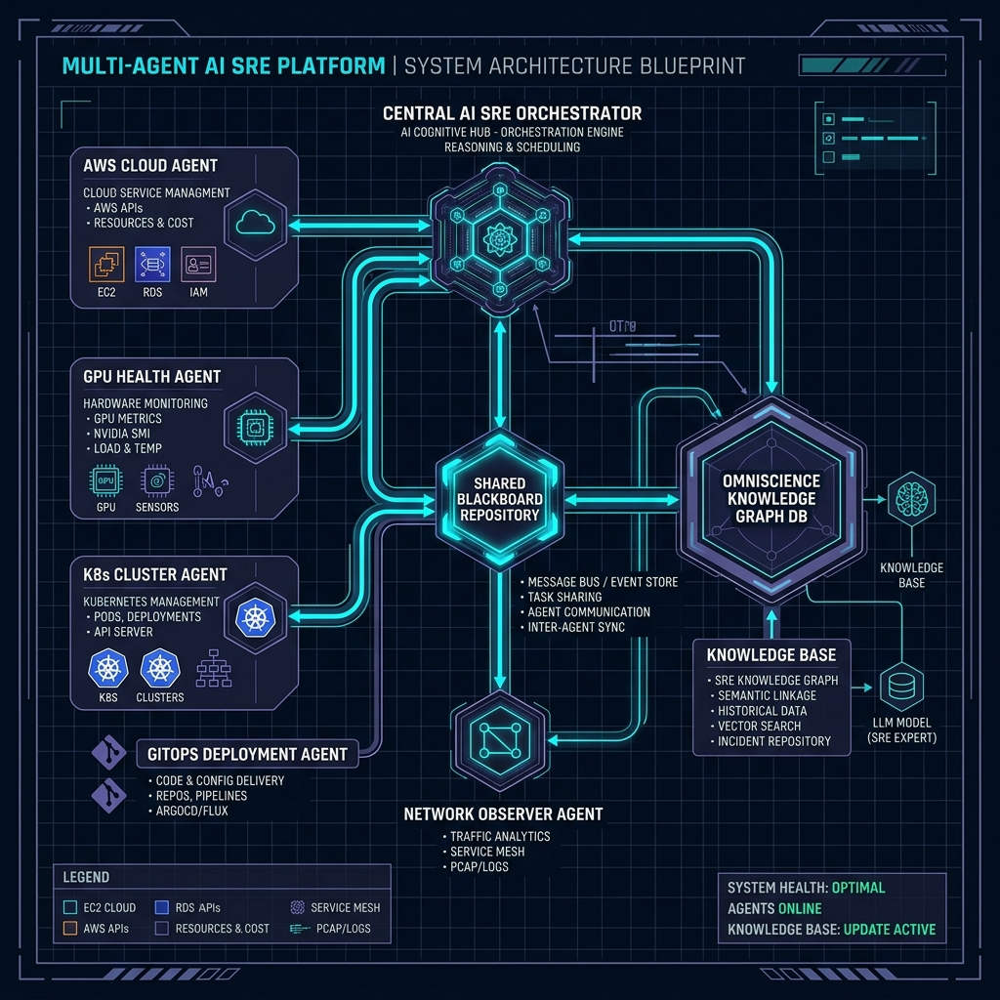
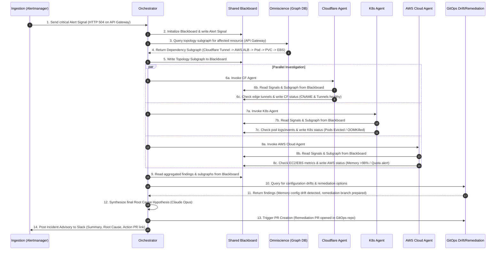

# AI SRE Component Connectivity & Signal Flow

This document details the architectural connectivity of the Platform Brain SRE (PB-SRE) system, the roles of all participating components, and the sequence of signal flows during an incident investigation.

---

## 1. System Architecture Blueprint

Below is the visual blueprint of the multi-agent AI SRE platform, illustrating how the agents communicate with each other, the shared Blackboard, and the Omniscience database.

---

## 2. Participating Components

The PB-SRE platform is composed of the following key modules:

1. **Ingestion API & Alerts Router**:
   - Ingests alerts from Prometheus/Alertmanager, CloudWatch, or Slack.
   - Deduplicates incoming notifications and routes them as standard signal payloads.
2. **Central AI SRE Orchestrator (Claude Opus)**:
   - The primary reasoning and task scheduling hub.
   - Coordinates the active investigation loop, delegates diagnostic tasks, and compiles the final incident advisory.
3. **Shared Blackboard Repository (`Blackboard`)**:
   - The central communication canvas.
   - Stores incident alerts, log metrics, the active topology subgraph, and specialist agent findings.
4. **Omniscience (Knowledge Graph & RAG Store)**:
   - Houses the platform dependency mapping (Neo4j), document chunks (Postgres), and vector embeddings (Qdrant).
   - Serves as the primary source of truth for platform topology and diagnostic runbooks.
5. **Specialist SRE Agents (Claude Sonnet)**:
   - **K8s Cluster Agent**: Inspects namespaces, pods, services, PVCs, and pod event logs.
   - **AWS Cloud Agent**: Inspects EC2 status, EBS performance, Transit Gateway Peering, and GuardDuty findings.
   - **Cloudflare Agent**: Inspects edge tunnels, DNS resolutions, and WAF events.
   - **GPU Health Agent**: Inspects DCGM metrics, NVLink health, ECC errors, and XID hardware errors.
   - **GitOps Agent / Drift Detector**: Scans Git configurations (Helm overlays) to detect manual drifts.
6. **GitOps Remediation Engine**:
   - Commits recommended configuration fixes to git and creates Pull Requests for human SRE reviews.

---

## 3. Signal Flow Sequence

The sequence below illustrates the chronological propagation of signals when a critical alert triggers:

