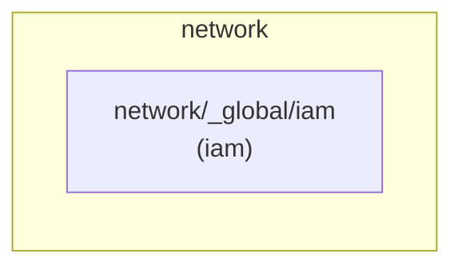

# Infrastructure diagram — `network`

Auto-generated by `scripts/generate-infra-diagrams.py`. Do not edit
by hand — re-run the script (or merge a PR that touches a unit;
the `generate-diagrams.yml` workflow regenerates on push to main).

