# Infrastructure diagram — repo-wide

Auto-generated by `scripts/generate-infra-diagrams.py`. Spans every
Terragrunt unit across all accounts. For per-account detail see the

```mermaid
graph LR
  subgraph _org["_org"]
    _org__global_aws_config["_org/_global/aws-config<br/>(aws-config)"]
    _org__global_budgets["_org/_global/budgets<br/>(unknown)"]
    _org__global_cloudtrail["_org/_global/cloudtrail<br/>(cloudtrail)"]
    _org__global_guardduty_org["_org/_global/guardduty-org<br/>(guardduty-org)"]
    _org__global_iam_baseline["_org/_global/iam-baseline<br/>(iam-baseline)"]
    _org__global_organization["_org/_global/organization<br/>(organization)"]
    _org__global_scps["_org/_global/scps<br/>(scps)"]
    _org__global_security_hub["_org/_global/security-hub<br/>(security-hub)"]
    _org__global_sso["_org/_global/sso<br/>(sso)"]
  end
  subgraph dev["dev"]
    dev__global_iam["dev/_global/iam<br/>(iam)"]
  end
  subgraph dr["dr"]
    dr__global_iam["dr/_global/iam<br/>(iam)"]
  end
  subgraph network["network"]
    network__global_iam["network/_global/iam<br/>(iam)"]
  end
  subgraph prod["prod"]
    prod__global_clustermesh_connect["prod/_global/clustermesh-connect<br/>(clustermesh-connect)"]
    prod__global_iam["prod/_global/iam<br/>(iam)"]
  end
  subgraph staging["staging"]
    staging__global_clustermesh_connect["staging/_global/clustermesh-connect<br/>(clustermesh-connect)"]
    staging__global_global_accelerator["staging/_global/global-accelerator<br/>(global-accelerator)"]
    staging__global_iam["staging/_global/iam<br/>(iam)"]
  end
  _org__global_aws_config -->|depends on| _org__global_aws_config__dep__kms(kms)
  _org__global_cloudtrail -->|depends on| _org__global_cloudtrail__dep__kms(kms)
  _org__global_cloudtrail -->|depends on| _org__global_cloudtrail__dep__organization(organization)
  _org__global_guardduty_org -->|depends on| _org__global_guardduty_org__dep__organization(organization)
  _org__global_scps -->|depends on| _org__global_scps__dep__organization(organization)
  _org__global_security_hub -->|depends on| _org__global_security_hub__dep__config(config)
  _org__global_security_hub -->|depends on| _org__global_security_hub__dep__guardduty(guardduty)
  _org__global_sso -->|depends on| _org__global_sso__dep__organization(organization)
  prod__global_clustermesh_connect -->|depends on| prod__global_clustermesh_connect__dep__cilium_euc1_platform(cilium_euc1_platform)
  prod__global_clustermesh_connect -->|depends on| prod__global_clustermesh_connect__dep__cilium_euw1_gpu_inference(cilium_euw1_gpu_inference)
  prod__global_clustermesh_connect -->|depends on| prod__global_clustermesh_connect__dep__cilium_euw1_platform(cilium_euw1_platform)
  staging__global_clustermesh_connect -->|depends on| staging__global_clustermesh_connect__dep__cilium_euc1(cilium_euc1)
  staging__global_clustermesh_connect -->|depends on| staging__global_clustermesh_connect__dep__cilium_euw1(cilium_euw1)
  staging__global_global_accelerator -->|depends on| staging__global_global_accelerator__dep__nlb_euc1(nlb_euc1)
  staging__global_global_accelerator -->|depends on| staging__global_global_accelerator__dep__nlb_euw1(nlb_euw1)
```

sibling `<account>.md` files in this directory.

