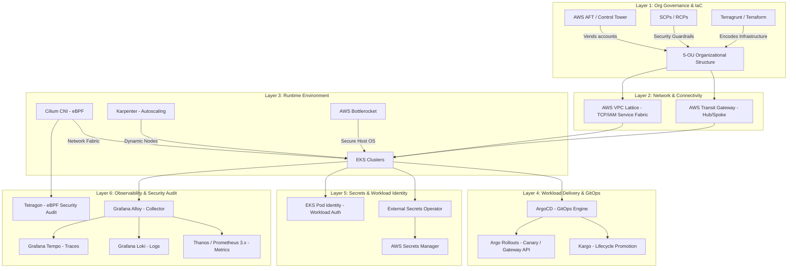

# Platform Engineering Manifest

This document defines the purpose, structure, core principles, and operational processes of our Internal Developer Platform (IDP). The manifest bridges the gap between infrastructure tooling and software development practices, transforming a disparate set of tools into a cohesive **Platform Engineering** discipline.

---

## 1. Fundamental Definitions and Philosophy

### What is a Platform?
A **Platform** is an integrated product built by dedicated engineers for the organization's developers. It consolidates cloud infrastructure, CI/CD tools, security controls, observability services, and development standards. 
The primary objective of the Platform is to enable developers to deliver code to production rapidly, securely, and independently, while minimizing their cognitive load.

### What is Platform Engineering?
**Platform Engineering** is the discipline of designing and building toolchains and workflows that enable developer self-service. 
* **DevOps** defines the cultural alignment between development and operations.
* **Platform Engineering** operationalizes this culture by treating the Platform as a Product (Platform-as-a-Product).

```
┌─────────────────────────────────────────────────────────┐
│                 Developers (Our Customers)              │
└────────────────────────────┬────────────────────────────┘
                             │ Self-Service (API, IDP Portal)
┌────────────────────────────▼────────────────────────────┐
│         Internal Developer Platform (IDP Product)       │
├─────────────────────────────────────────────────────────┤
│    Networks · Compute · Security · CI/CD · Metrics       │
└────────────────────────────▲────────────────────────────┘
                             │ Product Evolution & Governance
┌────────────────────────────┴────────────────────────────┐
│               Platform Engineering Team                 │
└─────────────────────────────────────────────────────────┘
```

### Our Core Pillars
1. **Platform-as-a-Product:** We do not force tools on developers. We study their needs (through user research, developer surveys, and DORA metrics) and build tools that developers *want* to use.
2. **Self-Service by Default:** Every action—such as creating a new microservice, provisioning a database, fetching secrets, or granting network access—must be executable by developers independently without requiring operations tickets (Zero-Ticket Operations).
3. **Golden Paths & Paved Roads:** The secure path must be the easiest path. We embed security, encryption, code signing, and audit standards directly into the platform's templates. Developers get compliance "out of the box."
4. **Minimized Cognitive Load:** Developers should focus on writing business logic, not on mastering the details of Transit Gateway routing, CNI subnet allocation, or raw IAM policy syntax.

---

## 2. Architectural Structure of the Platform

The technological structure of the platform is designed as a layered stack, where each layer performs a specific, decoupled function:



---

## 3. Platform Engineering Processes

Tools alone do not solve organizational friction. The operational processes governing change lifecycle, security, cost control, and developer feedback are what turn a collection of tools into a Platform Engineering practice.

### 3.1 Service Onboarding & Provisioning (Self-Service & Golden Paths)
Developers do not write Kubernetes manifests, CI/CD pipelines, or IAM roles from scratch.

```
Developer ──► CLI Tooling / Git Templates ──► Choose Template (NodeJS/Go)
                                                      │
                                                      ▼
Artifacts Provisioned ◄── Git Repo Scaffold ◄── Code & Pipeline Generation
```

* **Process:**
  1. The developer triggers the self-service template via CLI/Git templates and selects a microservice template (e.g., "Go REST Service").
  2. The portal automatically provisions a new Git repository pre-configured with reusable CI pipelines ([ADR-0015](file:///Users/lo/Develop/multi-team-agentic/project/platform-design/docs/adrs/0015-reusable-ci-pipelines.md)).
  3. The platform registers the new service in an ArgoCD ApplicationSet ([ADR-0012](file:///Users/lo/Develop/multi-team-agentic/project/platform-design/docs/adrs/0012-cluster-role-label-scheme-for-appsets.md)), generating deployment manifests for `dev`, `staging`, and `prod` environments.
  4. An IAM role is automatically provisioned and mapped to EKS Pod Identity ([ADR-0018](file:///Users/lo/Develop/multi-team-agentic/project/platform-design/docs/adrs/0018-eks-pod-identity-as-default-workload-identity.md)) with ABAC-based scoping.

### 3.2 Infrastructure Change Management (IaC GitOps)
Every infrastructure change must undergo an automated validation cycle before merging.

* **Process:**
  1. **Local Development:** A platform engineer writes infrastructure definitions using Terragrunt modules.
  2. **Pull Request Creation:** Opening a PR triggers static verification jobs:
     * `tflint` and `Checkov` (static configuration security scans).
     * `zizmor` (GitHub Actions workflow linting).
  3. **Security Gate (Access Analyzer):** The CI runs AWS Access Analyzer's `CheckNoNewAccess` ([ADR-0017](file:///Users/lo/Develop/multi-team-agentic/project/platform-design/docs/adrs/0017-resource-side-perimeter-and-declarative-org-controls.md)), comparing the policy diff derived from `terraform show -json`. If the change broadens access permissions, the PR is automatically blocked.
  4. **Peer Review:** Platform engineers review the code change and plan outputs.
  5. **Deployment:** Merging the change to `main` triggers an automated runner to execute `terragrunt apply` in the targeted environment.

### 3.3 Workload Lifecycle & Environment Promotion (Application Promotion)
Manual deployments (e.g., direct `kubectl apply` or manual image tag overrides in production) are disabled.

```
CI: Build & Sign ──► Dev Deploy (Auto) ──► Integration Testing (Auto)
                                                   │
                                                   ▼
Prod (Manual Approval) ◄── Staging (Auto) ◄── SLO-gated Promotion (Kargo)
```

* **Process:**
  1. **Build (CI):** A code commit triggers a pipeline that lints, tests, runs dependency audits (`pip-audit`/`npm audit`), signs the Docker image using Cosign ([ADR-0016](file:///Users/lo/Develop/multi-team-agentic/project/platform-design/docs/adrs/0016-tier1-supply-chain-hardening.md)), and publishes it to ECR.
  2. **Dev Deploy:** The CI updates image digests in the GitOps repo, and ArgoCD automatically syncs it to the Dev cluster.
  3. **Lifecycle Promotion via Kargo ([ADR-0021](file:///Users/lo/Develop/multi-team-agentic/project/platform-design/docs/adrs/0021-kargo-gitops-promotion-layer.md)):**
     * Upon passing automated tests in `dev`, Kargo promotes the change to `integration` and `staging`.
     * In `staging`, an automated SLO-gate (using Prometheus/Thanos) queries error rates and latency metrics.
     * If metrics remain within target SLO thresholds, the release is promoted to "Prod-ready."
  4. **Production Deployment:** The Release Manager triggers the final promotion in Kargo UI, prompting Argo Rollouts ([ADR-0014](file:///Users/lo/Develop/multi-team-agentic/project/platform-design/docs/adrs/0014-argo-rollouts-canary-progressive-delivery.md)) to canary-deploy the workload, dynamically shifting traffic using Gateway API.

### 3.4 Continuous Security & Runtime Governance (Continuous Governance)
Security compliance is verified continuously at runtime rather than during retrospective audits.

* **Process:**
  1. **Admission Control:** When scheduling a pod, Kyverno/VAP admission controllers ([ADR-0020](file:///Users/lo/Develop/multi-team-agentic/project/platform-design/docs/adrs/0020-kyverno-and-vap-policy-engine.md)) check:
     * Image signature validity via Cosign (proving it originated from trusted CI pipelines).
     * Pod Security Standard compliance (e.g., blocked root access, read-only root filesystems).
  2. **Runtime Monitoring (Tetragon eBPF):** Tetragon ([ADR-0019](file:///Users/lo/Develop/multi-team-agentic/project/platform-design/docs/adrs/0019-harvest-cilium-ebpf-capabilities.md)) monitors system calls within running containers. If an anomalous execution is detected (such as writing to `/etc/` or spawning an unexpected binary), Tetragon intercepts the call at the kernel level, terminates the process, and dispatches a high-priority alert to the Security Operations Center (SOC).

### 3.5 Cloud Cost Management & Optimization (FinOps Process)
Cloud cost visibility and efficiency are integrated into developer workflows.

* **Process:**
  1. **Data Collection:** OpenCost aggregates container resources (CPU, Memory, Storage) and maps them to real-time AWS Cost and Usage Report (CUR) billing data ([ADR-0027](file:///Users/lo/Develop/multi-team-agentic/project/platform-design/docs/adrs/0027-kubernetes-cost-opencost-cur.md)).
  2. **Visibility:** Cost allocation metrics are presented via Grafana dashboards grouped by team names (derived from Kubernetes labels).
  3. **Budget Allocations:** Teams are allocated quarterly cloud budgets.
  4. **Anomaly Alerts & Optimizations:** If the forecast predicts budget exhaustion, an alert notifies the team lead. Teams review cost efficiency regularly, utilizing Karpenter's consolidation features ([ADR-0007](file:///Users/lo/Develop/multi-team-agentic/project/platform-design/docs/adrs/0007-karpenter-over-cluster-autoscaler.md)) and transitioning non-critical workloads to ARM (Graviton) or Spot instances.

### 3.6 Feedback Loops & Platform Evolution
A platform must adapt to developers' needs to prevent shadow IT. We manage the platform as an internal commercial software product.

* **Process:**
  1. **User Research:** The Platform Team conducts quarterly interviews and surveys with application developers to map development friction and pain points.
  2. **North Star Metrics:** We continuously track:
     * **Time to Hello World:** The duration for a new hire to onboard and deploy their first code change to Dev (target: < 2 hours).
     * **DORA Metrics:** Deployment Frequency, Lead Time for Changes, Change Failure Rate, and Mean Time to Restore (MTTR).
  3. **Backlog Prioritization:** User feedback and metrics directly shape the platform's product backlog. Major architectural shifts or changes in practices are proposed and debated publicly via new Architecture Decision Records (ADRs).

---

## 4. KPIs of Success

We measure the health and effectiveness of our Platform Engineering practice using the following metrics:

* **Infrastructure Autonomy:** 95% of change operations for applications and dependencies (databases, cache, secrets) are handled by developers via self-service or GitOps pipelines without manual platform ticket creation.
* **Delivery Velocity:** The lead time for standard application changes to reach production is under 15 minutes (once automated integration and SLO gates pass).
* **Security & Compliance:** 100% of running container images in the EKS clusters are signed by Cosign and pass vulnerability scans.
* **Financial Transparency:** Unallocated/unattributed cloud costs constitute less than 5% of the total infrastructure monthly budget.
