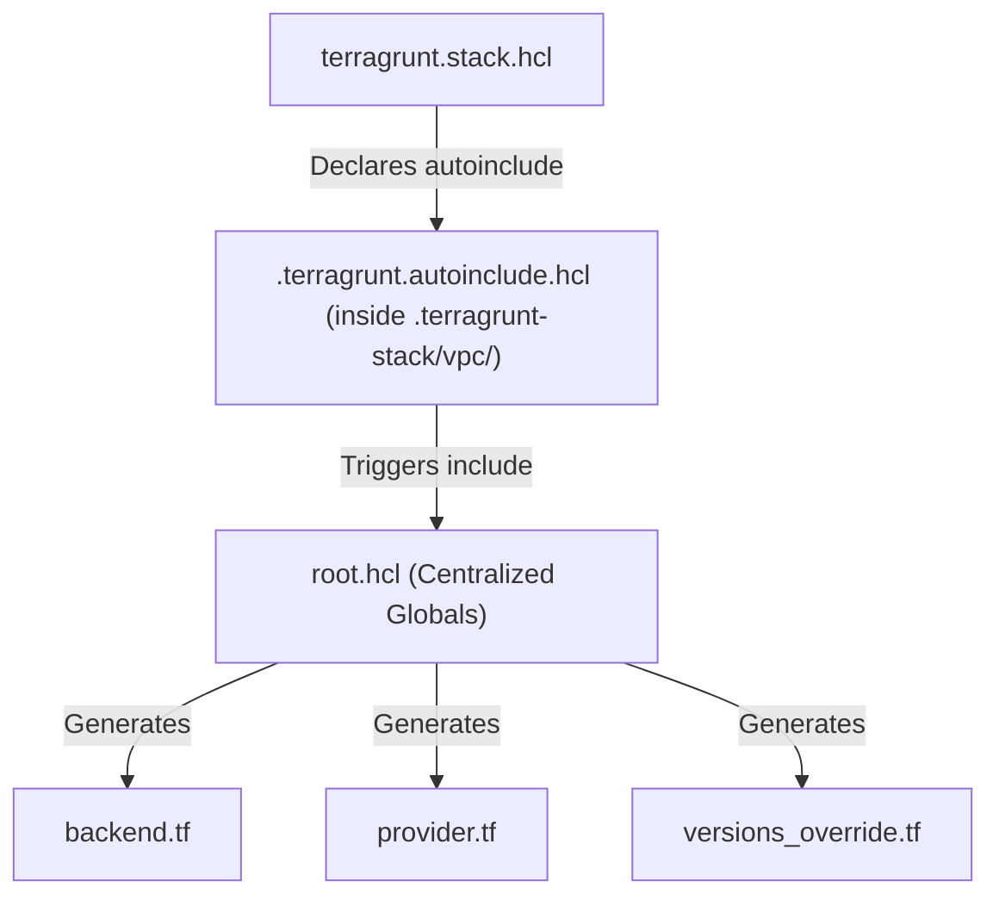
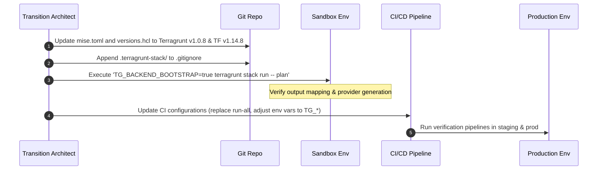

# Terragrunt v1.0.8 Migration Plan (Stacks & CLI Redesign)

- **Role**: Terragrunt 1.0 Transition Architect
- **Status**: Proposed
- **Target Version**: Terragrunt `v1.0.8` (Stacks & CLI Redesign)
- **Minimum Terraform/OpenTofu version**: `1.14.8`
- **Target Repository**: `project/platform-design/`

---

## 1. Executive Summary
This document defines the migration plan for transitioning our infrastructure catalog and deployment directories in `project/platform-design/` to **Terragrunt v1.0.8**. 

Terragrunt v1.0.8 represents a major milestone that officially stabilizes the **Stacks** feature (first introduced in v0.99.x experimental builds) and completely overhauls the command-line interface (CLI) to be more consistent, ergonomic, and production-safe. 

### Key Benefits of the Transition
*   **Explicit Orchestration (Stacks)**: Replaces directory-based implicit dependencies with declarative `terragrunt.stack.hcl` files. This eliminates complex folder hierarchies and creates a single-pane configuration for logical groups (e.g., the `platform` stack).
*   **Performance Improvements**: Compiles stack definitions and resolves dependency chains before execution, reducing OpenTofu/Terraform initialization times and state locking friction.
*   **CLI Consistency**: Standardizes commands using the hierarchical `run` and `hcl` namespaces, removing legacy flags (un-prefacing `terragrunt-`), and introducing the `--` separator to prevent flag confusion between Terragrunt and OpenTofu.
*   **Improved Safety**: Bootstrapping state buckets is now strictly opt-in (`--backend-bootstrap`), preventing accidental resource creation in accounts governed by restrictive Service Control Policies (SCPs).

---

## 2. Current Architecture Analysis
The current `terragrunt/` live deployment directory features a hierarchical structure designed around environments, accounts, and regions:

*   **Root Sourced Configuration**:
    *   [root.hcl](file:///Users/lo/Develop/multi-team-agentic/project/platform-design/terragrunt/root.hcl): Generates provider blocks, backend blocks (`backend.tf`), and version overrides (`versions_override.tf`). Handles sandbox vs. standard account state buckets (S3 native locking for sandbox; DynamoDB lock table for dev, staging, prod, etc.).
    *   [versions.hcl](file:///Users/lo/Develop/multi-team-agentic/project/platform-design/terragrunt/versions.hcl): Sets tool pins (Terraform `1.14.8` and Terragrunt `0.99.5`) and provider constraints (AWS `~> 6.0`, etc.).
    *   [common.hcl](file:///Users/lo/Develop/multi-team-agentic/project/platform-design/terragrunt/common.hcl): Shared project tags, metadata, and ADR-0028 taxonomy values.
*   **Traditional Directory Structure**:
    *   Units that are not stack-managed (e.g., [ecr-pull-through-cache](file:///Users/lo/Develop/multi-team-agentic/project/platform-design/terragrunt/shared/eu-west-1/ecr-pull-through-cache/terragrunt.hcl)) inherit these globals through explicit includes:
        ```hcl
        include "root" {
          path = find_in_parent_folders("root.hcl")
        }
        ```
*   **Stack-Managed Directory Structure**:
    *   Active stack-managed folders (e.g., [dev/eu-west-1/platform](file:///Users/lo/Develop/multi-team-agentic/project/platform-design/terragrunt/dev/eu-west-1/platform/terragrunt.stack.hcl)) define components inside `terragrunt.stack.hcl`.
    *   Currently, running commands generates transient HCL targets inside the hidden `.terragrunt-stack/` directory (e.g., `.terragrunt-stack/vpc/terragrunt.hcl`).

---

## 3. Migration to Terragrunt Stacks (`terragrunt.stack.hcl`)

In Terragrunt v1.0.8, **Explicit Stacks** are the standard abstraction for managing multiple units together. 

### Transition from Traditional directory trees to Stacks
Instead of mapping every state file to a physical subdirectory containing an isolated `terragrunt.hcl` file, a stack groups related units in a single `terragrunt.stack.hcl` file. 

*   **Unit Blocks**: Each infrastructure component is defined inside `terragrunt.stack.hcl` using a `unit` block.
*   **The `.terragrunt-stack/` Compilation Workspace**: When running stack commands, Terragrunt processes the `terragrunt.stack.hcl` file and generates a local workspace under `.terragrunt-stack/` containing the rendered `terragrunt.hcl` for each unit.
*   **Customizing Execution Path**: If you need to keep generated configs out of a hidden directory (for debugging or legacy pipelines), you can set `no_dot_terragrunt_stack = true` on the stack declaration.

### Proposed Stack Structure (`terragrunt.stack.hcl`)
Below is the standard configuration pattern for a platform stack in Terragrunt 1.0.8:

```hcl
# terragrunt/dev/eu-west-1/platform/terragrunt.stack.hcl

locals {
  account_vars = read_terragrunt_config(find_in_parent_folders("account.hcl"))
  region_vars  = read_terragrunt_config(find_in_parent_folders("region.hcl"))
  
  environment  = local.account_vars.locals.environment
  aws_region   = local.region_vars.locals.aws_region
}

# Autoinclude block ensures all stack units automatically inherit 
# root.hcl without repeating the include block in every unit file.
autoinclude {
  include "root" {
    path = find_in_parent_folders("root.hcl")
  }
}

unit "vpc" {
  source = "${get_repo_root()}/catalog/units/vpc"
  path   = "vpc"
}

unit "secrets" {
  source = "${get_repo_root()}/catalog/units/secrets"
  path   = "secrets"
}

unit "eks" {
  source       = "${get_repo_root()}/catalog/units/eks"
  path         = "eks"
  dependencies = [unit.vpc]
}

unit "rds" {
  source       = "${get_repo_root()}/catalog/units/rds"
  path         = "rds"
  dependencies = [unit.vpc, unit.secrets]
}
```

---

## 4. DRY Backend & Provider Design (Global `root.hcl`)

In Terragrunt v1.0.8, we preserve a central `root.hcl` to generate the provider configuration, the state backend configuration, and version overrides.

### The Stack Integration Pattern (`autoinclude`)
Because `terragrunt.stack.hcl` files do not directly support the `include` statement, they rely on the **`autoinclude`** block.
At generation time, Terragrunt writes the contents of the `autoinclude` block into a `.terragrunt.autoinclude.hcl` file inside each compiled unit directory. This auto-include file is implicitly loaded, triggering the include of `root.hcl`:



### Proposed Structure of the New Central `root.hcl`
We keep the `root.hcl` DRY by using conditional logic based on environment flags (such as `is_sandbox` to swap between S3 native locking and DynamoDB tables). 

```hcl
# terragrunt/root.hcl
locals {
  versions     = read_terragrunt_config(find_in_parent_folders("versions.hcl"))
  common       = read_terragrunt_config(find_in_parent_folders("common.hcl"))
  account_vars = read_terragrunt_config(find_in_parent_folders("account.hcl"))
  region_vars  = read_terragrunt_config(find_in_parent_folders("region.hcl"))

  account_name = local.account_vars.locals.account_name
  account_id   = local.account_vars.locals.account_id
  aws_region   = local.region_vars.locals.aws_region
  environment  = local.account_vars.locals.environment
  is_sandbox   = local.account_name == "sandbox"
  
  state_bucket_region = try(local.account_vars.locals.state_bucket_region, local.aws_region)
}

terragrunt_version_constraint = local.versions.locals.terragrunt_version_constraint

# Remote state generation
remote_state {
  backend = "s3"
  generate = {
    path      = "backend.tf"
    if_exists = "overwrite_terragrunt"
  }
  config = merge(
    {
      bucket  = local.is_sandbox ? "opsfleet-terraform-state-${local.account_id}" : "tfstate-${local.account_name}-${local.aws_region}"
      key     = "${local.environment}/${path_relative_to_include()}/terraform.tfstate"
      region  = local.state_bucket_region
      encrypt = true
    },
    local.is_sandbox
    ? {
        use_lockfile        = true
        dynamodb_table      = null
        dynamodb_table_tags = null
      }
    : {
        use_lockfile   = false
        dynamodb_table = "terraform-locks-${local.account_name}"
      }
  )
}

# AWS Provider generation
generate "provider" {
  path      = "provider.tf"
  if_exists = "overwrite_terragrunt"
  contents  = <<-EOF
    provider "aws" {
      region = "${local.aws_region}"
      %{if !local.is_sandbox}
      assume_role {
        role_arn = "arn:aws:iam::${local.account_id}:role/TerragruntDeployRole"
      }
      %{endif}
      default_tags {
        tags = {
          Environment = "${local.environment}"
          ManagedBy   = "terragrunt"
          Account     = "${local.account_name}"
          Region      = "${local.aws_region}"
        }
      }
    }
  EOF
}
```

---

## 5. Explicit Dependency Output Mapping

In older experimental stack frameworks, Terragrunt attempted "auto-inheritance" or auto-wiring of outputs into inputs of dependent modules if their names matched (e.g., an output named `vpc_id` automatically binding to an input named `vpc_id`).

### The Change in Terragrunt v1.0
To enforce predictability and eliminate "spooky action at a distance," **auto-inheritance is disabled**. All dependency values must be mapped explicitly. 

If a module depends on another, you must:
1.  Declare a `dependency` block pointing to the dependency folder path.
2.  Explicitly assign the dependency's outputs to specific variables in the `inputs` block.
3.  Utilize `mock_outputs` to allow commands like `plan` and `validate` to run successfully before the dependencies have been applied.

### Concrete Implementation Examples

#### A. EKS Depending on VPC
```hcl
# catalog/units/eks/terragrunt.hcl

dependency "vpc" {
  config_path = "../vpc"

  mock_outputs = {
    vpc_id          = "vpc-00000000000000000"
    private_subnets = ["subnet-00000000000000000", "subnet-11111111111111111"]
  }
  mock_outputs_allowed_terraform_commands = ["init", "validate", "plan"]
}

inputs = {
  vpc_id                   = dependency.vpc.outputs.vpc_id
  subnet_ids               = dependency.vpc.outputs.private_subnets
  control_plane_subnet_ids = dependency.vpc.outputs.private_subnets
}
```

#### B. RDS Depending on VPC and Secrets
```hcl
# catalog/units/rds/terragrunt.hcl

dependency "vpc" {
  config_path = "../vpc"
  mock_outputs = {
    vpc_id          = "vpc-00000000000000000"
    private_subnets = ["subnet-00000000000000000"]
  }
  mock_outputs_allowed_terraform_commands = ["init", "validate", "plan"]
}

dependency "secrets" {
  config_path = "../secrets"
  mock_outputs = {
    database_password_secret_arn = "arn:aws:secretsmanager:eu-west-1:000000000000:secret:mock-pwd"
  }
  mock_outputs_allowed_terraform_commands = ["init", "validate", "plan"]
}

inputs = {
  vpc_id             = dependency.vpc.outputs.vpc_id
  database_subnets   = dependency.vpc.outputs.private_subnets
  db_password_arn    = dependency.secrets.outputs.database_password_secret_arn
}
```

---

## 6. CLI Command & Environment Variable Mapping

The CLI redesign in Terragrunt v1.0.8 reorganizes commands and removes the `--terragrunt-` prefixes from flags. Crucially, a `--` separator must now be used to separate Terragrunt arguments from the flags passed down to OpenTofu/Terraform.

### Command Mapping Reference

| Legacy Command / Pattern | Terragrunt v1.0.8 Equivalent | Scope | Description |
| :--- | :--- | :--- | :--- |
| `terragrunt run-all plan` | `terragrunt run --all -- plan` | Directory | Plans all standard directory-based modules. |
| `terragrunt run-all apply` | `terragrunt run --all -- apply` | Directory | Applies all standard directory-based modules. |
| `terragrunt stack plan` | `terragrunt stack run -- plan` | Stack | Plans all units inside a `terragrunt.stack.hcl` file. |
| `terragrunt stack apply` | `terragrunt stack run -- apply` | Stack | Applies all units inside a `terragrunt.stack.hcl` file. |
| `terragrunt hclfmt` | `terragrunt hcl fmt` | Utilities | Formats HCL configurations. |
| `terragrunt hclfmt --check` | `terragrunt hcl format --check` | Utilities | Checks formatting without rewriting. |
| `terragrunt graph-dependencies` | `terragrunt graph` | Debugging | Generates dependency graph representation. |

### CLI Flag Mapping Reference

| Legacy CLI Flag | Terragrunt v1.0.8 Flag | Description |
| :--- | :--- | :--- |
| `--terragrunt-non-interactive` | `--non-interactive` | Disable interactive prompts. |
| `--terragrunt-working-dir <path>` | `--working-dir <path>` | Set execution directory. |
| `--terragrunt-config <file>` | `--config <file>` | Specify target HCL file. |
| `--terragrunt-download-dir <path>`| `--download-dir <path>` | Override temporary cache path. |
| `--terragrunt-no-auto-approve` | `--no-auto-approve` | Require explicit confirmation. |

### Environment Variable Mapping

| Legacy Environment Variable | Terragrunt v1.0.8 Env Var | Purpose |
| :--- | :--- | :--- |
| `TERRAGRUNT_CONFIG` | `TG_CONFIG` | Specifies path to config file. |
| `TERRAGRUNT_DOWNLOAD` | `TG_DOWNLOAD` | Defines download cache directory. |
| `TERRAGRUNT_NON_INTERACTIVE` | `TG_NON_INTERACTIVE` | Enables non-interactive executions. |
| `TERRAGRUNT_BACKEND_BOOTSTRAP`| `TG_BACKEND_BOOTSTRAP` | Controls remote backend bootstrapping. |

> [!WARNING]  
> Failure to use the `--` separator (e.g., `terragrunt run --all plan` instead of `terragrunt run --all -- plan`) will result in Terragrunt attempting to interpret the command arguments, causing configuration parsing errors.

---

## 7. Backend Bootstrapping & Ignored Artifacts

### Opt-In Backend Bootstrapping
In Terragrunt v1.0.8, automatic remote state backend initialization (e.g., creation of S3 buckets and DynamoDB lock tables) is strictly **opt-in**. This prevents security errors in environments with restrictive policies.

To enable backend creation, you must explicitly set one of the following:
*   Pass the flag: `--backend-bootstrap`
*   Define the environment variable: `TG_BACKEND_BOOTSTRAP=true`

Example execution command for bootstrapping state backends:
```bash
TG_BACKEND_BOOTSTRAP=true terragrunt stack run -- apply
```

### Gitignoring Stack Execution Workspaces
When running `terragrunt stack` commands, Terragrunt generates execution workspaces in local `.terragrunt-stack/` folders. These contain transient unit configurations, secrets, and provider caches. **They must never be committed to Git**.

Add the following pattern to the repository's `.gitignore` file:
```gitignore
# Terragrunt Stack execution cache
.terragrunt-stack/
**/.terragrunt-stack/
```

---

## 8. Actionable Migration Steps

We propose a phased migration rollout across the platform repository:



### Phase 1: Tool Version Pins & Gitignore Update
1. Update tool versions in `terragrunt/versions.hcl` to `terragrunt_version = "1.0.8"`.
2. Mirror this version change inside `terragrunt/mise.toml` (`terragrunt = "1.0.8"`).
3. Append `.terragrunt-stack/` and `**/.terragrunt-stack/` to `.gitignore`.

### Phase 2: Configuration Validation in Sandbox
1. Navigate to the sandbox platform stack: `cd terragrunt/sandbox/eu-west-1/minimal-platform/`.
2. Run stack verification:
   ```bash
   TG_BACKEND_BOOTSTRAP=true terragrunt stack run -- plan
   ```
3. Verify that the generated provider, backend, and versions configurations are successfully rendered within `.terragrunt-stack/`.

### Phase 3: CI/CD Pipeline Updates
1. Scan pipeline definitions (e.g., `.github/workflows/` or GitLab CI configuration) for legacy commands.
2. Replace `terragrunt run-all` with `terragrunt run --all --`.
3. Update environment variables from `TERRAGRUNT_*` to `TG_*`.
4. Ensure `TG_BACKEND_BOOTSTRAP=true` is set on the initial environment setup jobs.
