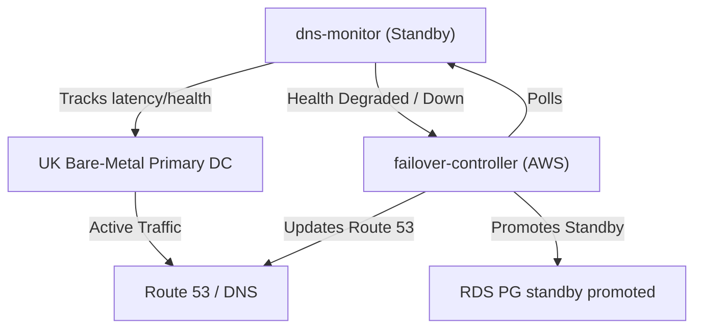

# SRE Runbook: UK Bare-Metal DC Failover and Failback

This runbook covers the planned and unplanned failover procedures for the 3-Tier trading and order execution platform from the primary **UK Bare-Metal Data Center (DC)** to the hot-standby AWS infrastructure, as well as the fallback procedures to restore primary operations.

---

## 1. Disaster Recovery Metrics & Targets

The platform implements a **Hot-Standby / Multi-Region** architecture to satisfy the following Service Level Objectives (SLOs) during a disaster scenario:

| Metric | Target | Details / Scope |
| :--- | :--- | :--- |
| **RTO (Recovery Time Objective)** | **< 15 minutes** | Planned failover (maintenance/migration) |
| **RTO (Recovery Time Objective)** | **< 30 minutes** | Unplanned failover (total hardware/network failure) |
| **RPO (Recovery Point Objective)** | **< 60 seconds** | All transactional and trade database states |

---

## 2. Workload & Data Tiers

The recovery procedure spans three distinct application data classes:

### 2.1 Time-Series Trade Data (QuestDB)
- **Role**: Ingests high-throughput trade and order execution telemetry.
- **Replication Strategy**: Real-time replication using specialized double-write gateways combined with hourly block-level snapshots to Amazon S3.

### 2.2 Relational Master Data (PostgreSQL / RDS)
- **Role**: Config, user balances, master records, and state.
- **Replication Strategy**: WAL (Write-Ahead Logging) physical streaming replication from primary UK bare-metal PG instance to AWS Aurora PostgreSQL Global Database / RDS Hot-Standby.

### 2.3 Analytical Data Lake (Apache Iceberg / S3)
- **Role**: Long-term historical trades, audits, and reporting.
- **Replication Strategy**: AWS S3 Cross-Region Replication (CRR) and Apache Iceberg metadata pointer synchronization.

---

## 3. Replication & Site-Replication Verification

Before initiating any failover, SREs must verify the integrity and delay of replication streams.

### 3.1 Database WAL Replication Verification
Execute the following check on the **standby database (AWS RDS/Aurora)** to verify the replication lag (LSN difference):
```sql
SELECT 
    pg_last_wal_receive_lsn() AS received_lsn,
    pg_last_wal_replay_lsn() AS replayed_lsn,
    pg_last_xact_replay_timestamp() AS last_transaction_time,
    now() - pg_last_xact_replay_timestamp() AS replication_lag;
```
*Criteria*: `replication_lag` must be `< 60 seconds` for a clean failover.

### 3.2 Standby Status Verification
Verify that the standby database is indeed running in **Recovery Mode**:
```sql
SELECT pg_is_in_recovery();
```
*Criteria*: Returns `true`. If `false`, the database is not in standby mode.

### 3.3 S3 / Apache Iceberg Replication Validation
Check the S3 replication status via AWS CLI using the synchronization metric:
```bash
aws cloudwatch get-metric-data --metric-data-queries '[{"Id":"m1","MetricStat":{"Metric":{"Namespace":"AWS/S3","MetricName":"ReplicationLatency","Dimensions":[{"Name":"BucketName","Value":"trading-iceberg-data"},{"Name":"DestinationBucket","Value":"trading-iceberg-data-replica"}]},"Period":300,"Stat":"Average"}}]' --start-time $(date -u -v-1H +%Y-%m-%dT%H:%M:%SZ) --end-time $(date -u +%Y-%m-%dT%H:%M:%SZ)
```
*Criteria*: Average Replication Latency should be `< 60 seconds`.

---

## 4. Automated Failover Engine Architecture

The platform uses a Go-based automated orchestration suite to automate active monitoring and failover:



- **`dns-monitor`**: A lightweight Go service deployed in the standby environment. It periodically performs active synthetic health checks and DNS resolution validations on the primary endpoint.
- **`failover-controller`**: A distributed controller that acts on metrics exported by `dns-monitor`. It implements a raft/state-machine structure to prevent split-brain and coordinates the database promotion and DNS Route53 updates when failure is confirmed.

---

## 5. Step-by-Step Runbook Execution

### PHASE 1: Failover Trigger & Verification
If the automated failover has not triggered, SREs must manually verify the failure before promoting:
1. Check Prometheus metrics for DNS monitor health:
   ```bash
   curl -s http://dns-monitor.monitoring.svc.cluster.local:8080/metrics | grep dns_resolution_status
   ```
2. Verify logs of `failover-controller` to ensure it has entered the `PRE_FAILOVER` state:
   ```bash
   kubectl logs -n platform deployment/failover-controller -c controller --tail=100
   ```

### PHASE 2: Target Database Promotion
To manually promote the RDS PostgreSQL standby database:
1. Log in to the secondary database container or bastion host.
2. Execute the promotion command to bring the database out of recovery mode:
   ```sql
   SELECT pg_promote(wait := true);
   ```
3. Confirm the database is writable by running:
   ```sql
   SELECT pg_is_in_recovery();
   ```
   *Expected Output*: `false`.

### PHASE 3: DNS Switchover (Route 53)
1. Verify Route53 DNS health checks are redirecting traffic.
2. If manual switch is required, run the preconfigured sync script using GitHub Actions or locally:
   ```bash
   scripts/dns-sync.sh --zone example.com --target aws-edge-alb.us-east-1.elb.amazonaws.com
   ```
3. Query international DNS servers to ensure propagation:
   ```bash
   dig +trace trading.example.com
   ```

### PHASE 4: Verification & Smoke Tests
Once traffic is routed to AWS, perform the following validation suite:
1. Check that the `hello-world` and trading endpoints are returning `200 OK`:
   ```bash
   curl -I https://trading.example.com/healthz
   ```
2. Confirm order database connectivity and write safety:
   ```bash
   # Run synthetic write test
   curl -X POST -d '{"test": true}' https://trading.example.com/api/v1/orders/test-write
   ```

### PHASE 5: Fallback / Failback Procedure
Once the UK Bare-Metal DC is recovered and fully functional, follow these steps to failback to the primary site:

1. **Lock API Writes**: Put the AWS active instance into read-only mode to prevent new data drift:
   ```sql
   ALTER SYSTEM SET default_transaction_read_only = 'on';
   SELECT pg_reload_conf();
   ```
2. **Synchronize Backlog**: Wait for final WAL buffers and Iceberg S3 buckets to synchronize back to the UK Bare-Metal PG standby database.
3. **Verify LSN Alignment**: Ensure the UK database matches the AWS transaction log exactly.
4. **Promote UK Database**: Promote the UK PG instance to primary:
   ```sql
   SELECT pg_promote(wait := true);
   ```
5. **Restore Writes on UK**: Enable read-write transactions on the UK primary.
6. **Switch DNS Back**: Update Route53/registrar to target the UK Bare-Metal DC ingress load balancers.
7. **Unlock AWS Standby**: Configure the AWS database back as a physical read-replica/standby of the UK primary database.
