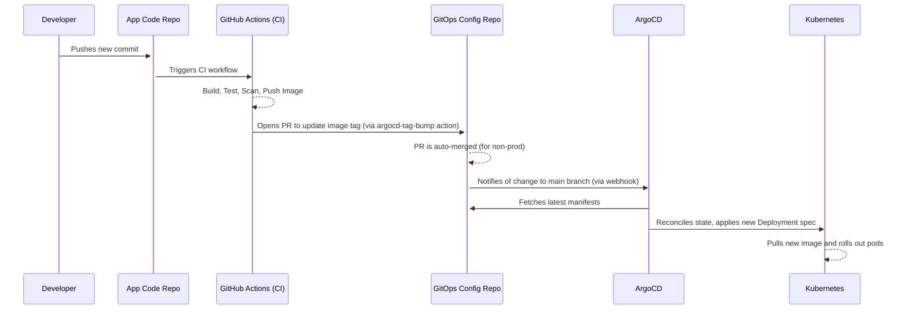

# Standard Specification: CI/CD Automation (SPEC-CICD-GHACTIONS)

- **ID:** `SPEC-CICD-GHACTIONS`
- **Name:** CI/CD Automation
- **Status:** **Ready**
- **Dependencies:** `SPEC-GITOPS-ARGOCD`

---

## 1. Purpose

This specification describes the standard for the CI/CD automation pipelines. This component acts as the "glue" that connects the application source code repository to the GitOps deployment system, providing a fast and secure path from commit to production.

## 2. Technologies

| Technology | Purpose |
| :--- | :--- |
| **GitHub Actions** | The primary CI/CD automation tool. |
| **`yq`** | A command-line utility for programmatically modifying YAML files. |
| **`gh` CLI** | A command-line tool for interacting with the GitHub API (e.g., creating Pull Requests). |

## 3. Architecture and Strategy

The platform uses an advanced architecture with a clear separation of concerns and multiple layers of reusable logic.

### 3.1. Key Patterns

- **Two-Repository Model:**
    1.  **Application Code Repo (`platform-design`):** This is where development happens and CI pipelines are triggered (build, test, scan).
    2.  **GitOps Config Repo (`100rd/argocd`):** This stores the declarative state of all applications and their versions (as `values.yaml` files). ArgoCD monitors this repository.
- **Granular & Reusable Workflows:**
    - Workflows in `.github/workflows/` are highly specific (`yaml-lint.yml`, `secret-scan.yml`).
    - The system heavily uses **reusable workflows** (`reusable-build-and-push.yml`) for standardization and **custom composite actions** (`.github/actions/`) to encapsulate common steps (e.g., `trivy-scan`).
- **Comprehensive PR Validation:** Before merging to `main`, code undergoes an extensive set of checks, including:
    - **Linting:** `yamllint`, `shellcheck`.
    - **IaC Analysis:** `terragrunt plan`, `tflint`, `tfsec`.
    - **Security Scanning:** `gitleaks`, `sast-codeql`, `trivy-scan`.
    - **Cost Analysis:** `infracost`.

### 3.2. The Core Process: Promotion via GitOps (`argocd-tag-bump`)

The handoff from CI to CD is managed through Git, which is the essence of GitOps. This process is implemented in the `.github/actions/argocd-tag-bump` custom action:

1.  **Trigger:** After a new image is successfully built and pushed to ECR, the CI pipeline invokes the `argocd-tag-bump` action.
2.  **Checkout:** The action clones the separate **GitOps config repository**.
3.  **Update YAML:** Using `yq`, it locates the correct `values.yaml` for the application and environment, then updates the `image.tag` and `image.digest` fields.
4.  **Create Pull Request:** The action creates a new branch and opens a pull request against the config repository. The PR body is populated with full traceability information (links to source commit and CI run).
5.  **Auto-Merge (Non-Prod):** For `dev` and `stage` environments, the PR is automatically labeled with `auto-merge`. A bot (e.g., Mergify) in the config repository then merges the PR automatically.
6.  **Deploy:** Once the PR is merged, ArgoCD detects the change in the `values.yaml` file and automatically initiates a sync, rolling out the new application version to the cluster.

## 4. Process Flow

