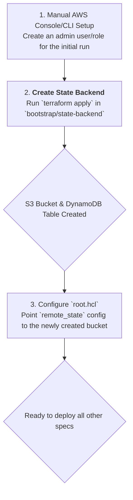

# Standard Specification: IaC Tooling & State Setup (SPEC-IAC-SETUP)

- **ID:** `SPEC-IAC-SETUP`
- **Name:** IaC Tooling & State Setup
- **Status:** **Ready**
- **Dependencies:** None

---

## 1. Purpose

This specification describes the standard for the foundational Infrastructure as Code (IaC) tooling and the remote state backend. This setup is the prerequisite for all other automated infrastructure management.

## 2. Technologies

| Technology | Version | Purpose |
| :--- | :--- | :--- |
| **Terraform** | `1.14.8` | The core IaC tool for declaring and managing cloud resources. |
| **Terragrunt**| `0.99.5` | An orchestrator for Terraform that provides DRY (Don't Repeat Yourself) configurations, remote state management, and dependency orchestration. |

## 3. Architecture: Centralized and Hierarchical

The project uses a sophisticated, hierarchical Terragrunt structure to manage a multi-account, multi-region deployment.

### 3.1. Key Patterns & Configuration

The central logic is defined in `terragrunt/root.hcl`, which is included in all child configurations.

- **Hierarchical Configuration:** Context (account name, region, variables) is inherited from `account.hcl` and `region.hcl` files located in parent directories. This is a powerful Terragrunt pattern for managing environments.
- **Dynamic Backend:** The `remote_state` configuration dynamically generates the S3 backend configuration for storing Terraform state. The bucket name and key are generated based on the account, region, and module path, ensuring strict state isolation.
- **Dynamic Provider Configuration:** The `generate "provider"` block creates a `provider.tf` file on-the-fly, configuring the AWS provider with the correct region and an `assume_role` block for secure CI/CD authentication.
- **Strict Version Pinning:** Terraform and provider versions are hard-coded in `versions.hcl` and enforced via a `generate "versions"` block, ensuring consistent and predictable builds.

### 3.2. Directory Structure

- `terraform/modules/`: Contains a library of local, reusable Terraform modules that form the core of the platform (VPC, EKS, IAM, etc.).
- `terragrunt/`: Contains the "live" infrastructure configuration, where modules are called with specific parameters. The structure mirrors the logical division of accounts and regions.
- `bootstrap/state-backend/`: Contains the initial Terraform code to create the S3 bucket and DynamoDB table for the Terraform state backend. This is the entry point for bootstrapping a new platform deployment.

## 4. Deployment Sequence

Bootstrapping the IaC foundation is the first step in deploying the platform.

### Sequence Description:

1.  **Initial AWS Access:** An IAM principal (user or role) with permissions to create S3 buckets and DynamoDB tables is required for the very first run.
2.  **Create State Backend:** The code in `bootstrap/state-backend/main.tf` is executed. This one-time action provisions the necessary AWS resources to store the state for the *rest* of the infrastructure.
3.  **Configure Root:** The `terragrunt/root.hcl` file is configured to point to the newly created state bucket. From this point forward, all `terragrunt` commands will use this remote state.
4.  **Ready State:** Once the state backend is configured, Terragrunt can be used to deploy all other components of the platform, as their state will be managed centrally and securely.
