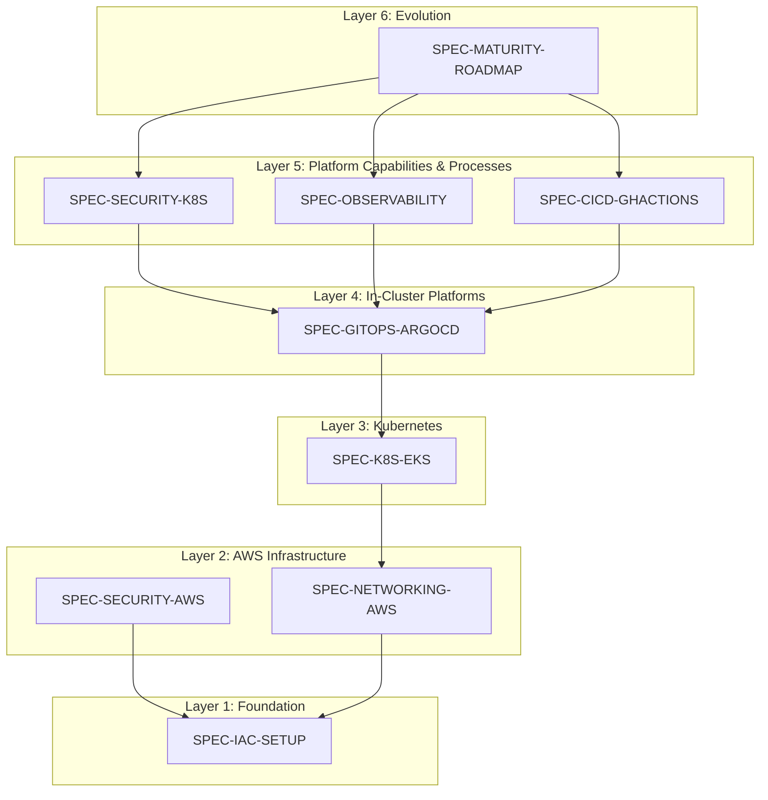

# Platform Specification Index (SPEC-INDEX)

## 1. Introduction

This document serves as the master table of contents and dependency map for all specifications describing the platform's components. Each specification (`SPEC-*`) represents a standard for deploying and configuring a specific technology block.

## 2. Specification Map and Dependencies

The table below outlines the platform's deployment sequence, the status of each specification, and their dependencies.

| Order | Spec ID | Component Name | Status | Dependencies | Brief Description |
|:---|:---|:---|:---|:---|:---|
| 1 | `SPEC-IAC-SETUP` | IaC Tooling & State Setup | **Ready** | - | Standard for configuring IaC tools (Terraform, Terragrunt) and creating the state backend. The absolute foundation. |
| 2 | `SPEC-SECURITY-AWS` | Foundational AWS Security | **Ready** | `SPEC-IAC-SETUP` | Standard for configuring baseline security components at the AWS Organization level (IAM, SCPs, GuardDuty). |
| 3 | `SPEC-NETWORKING-AWS`| AWS Network Infrastructure | **Ready** | `SPEC-IAC-SETUP` | Standard for deploying the core network topology (VPCs, Transit Gateway). |
| 4 | `SPEC-K8S-EKS` | EKS Cluster Standard | **Ready** | `SPEC-NETWORKING-AWS` | Standard for deploying an EKS cluster, including the CNI (Cilium), autoscaler (Karpenter), and core add-ons. |
| 5 | `SPEC-GITOPS-ARGOCD`| GitOps Platform | **Ready** | `SPEC-K8S-EKS` | Standard for installing and configuring ArgoCD as the core application delivery system. |
| 6 | `SPEC-SECURITY-K8S` | Kubernetes Security | **Ready** | `SPEC-GITOPS-ARGOCD` | Standard for configuring in-cluster security components (Network Policies, OPA, Falco) deployed via GitOps. |
| 7 | `SPEC-OBSERVABILITY`| Observability Platform | **Ready** | `SPEC-GITOPS-ARGOCD` | Standard for deploying the full observability stack (Prometheus, Loki, Tempo) via GitOps. |
| 8 | `SPEC-CICD-GHACTIONS`| CI/CD Automation | **Ready** | `SPEC-GITOPS-ARGOCD` | Standard for CI pipelines and the promotion process into the GitOps repository. |
| 9 | `SPEC-MATURITY-ROADMAP`| Platform Maturity Roadmap | **Ready** | All | A proposal for enhancements to improve Developer Experience, Governance, and Operational Excellence. |

---

### Dependency Visualization

