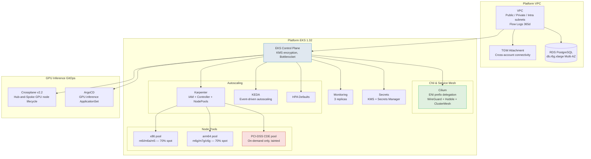
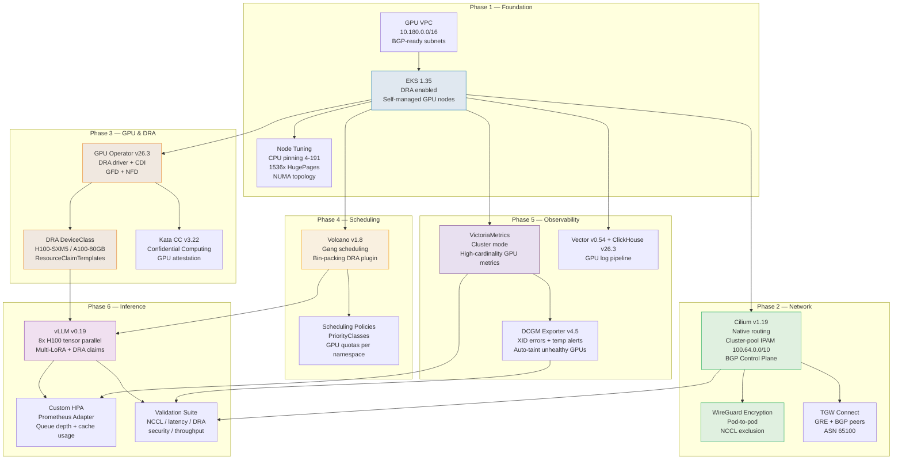
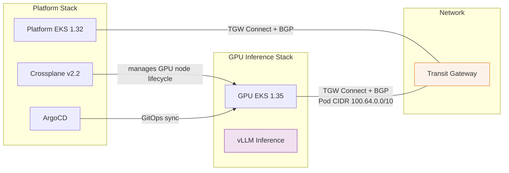

# prod / eu-west-1

Production region deployment in **eu-west-1** (Ireland) across three availability zones (`eu-west-1a`, `eu-west-1b`, `eu-west-1c`).

## Stacks

### Platform (`platform/`)

General-purpose EKS platform cluster for application workloads.

| Unit | Purpose |
|------|---------|
| `vpc` | Platform VPC with public, private, and intra subnets; VPC Flow Logs (365-day retention) |
| `tgw-attachment` | Transit Gateway VPC attachment for cross-account connectivity |
| `secrets` | KMS keys and Secrets Manager resources |
| `eks` | EKS 1.32 cluster with KMS envelope encryption, Bottlerocket managed node groups (m6i.2xlarge, 3-10 nodes) |
| `cilium` | Cilium CNI with ENI prefix delegation, WireGuard encryption, Hubble observability, ClusterMesh |
| `karpenter-iam` | IAM roles and instance profiles for Karpenter |
| `karpenter-controller` | Karpenter v1 controller deployment |
| `karpenter-nodepools` | Multi-architecture node pools: x86, arm64, c-series, PCI-DSS CDE (dedicated on-demand, tainted) |
| `keda` | KEDA event-driven autoscaler (3 operator replicas, 3 metrics server replicas) |
| `hpa-defaults` | Default HPA policies for platform workloads |
| `wpa` | Weighted Pod Autoscaler (disabled in prod) |
| `rds` | RDS PostgreSQL (db.r6g.xlarge, 100 GB, Multi-AZ) |
| `monitoring` | Monitoring stack (3 replicas) |
| `gpu-inference-crossplane` | Crossplane v2.2 hub for GPU node lifecycle management |
| `gpu-inference-argocd` | ArgoCD project and ApplicationSet for GPU inference GitOps |

### GPU Inference (`gpu-inference/`)

Dedicated EKS cluster for large-scale GPU inference workloads. Designed for up to **5,000 nodes** with NVIDIA H100 SXM5 GPUs (p5.48xlarge).

| Unit | Phase | Purpose |
|------|-------|---------|
| `gpu-inference-vpc` | Foundation | Dedicated VPC (10.180.0.0/16) with BGP-ready subnets and TGW Connect attachment |
| `gpu-inference-eks` | Foundation | EKS 1.35 with DRA (Dynamic Resource Allocation), self-managed GPU node groups |
| `gpu-inference-node-tuning` | Foundation | CPU pinning (cores 4-191 isolated), 1536x 2Mi HugePages, NUMA topology for p5.48xlarge |
| `gpu-inference-cilium` | Network | Cilium v1.19 native routing, cluster-pool IPAM (100.64.0.0/10), BGP Control Plane for TGW Connect peering |
| `gpu-inference-cilium-encryption` | Network | WireGuard transparent pod-to-pod encryption, NCCL traffic exclusion, high-scale operator tuning |
| `gpu-inference-tgw-connect` | Network | Transit Gateway Connect GRE tunnels with BGP peers (ASN 65100) for Pod CIDR route advertisement |
| `gpu-inference-gpu-operator` | GPU | NVIDIA GPU Operator v26.3 with DRA driver, CDI, GPU Feature Discovery, NFD |
| `gpu-inference-dra` | GPU | DeviceClass definitions (H100-SXM5, A100-80GB) and ResourceClaimTemplates (single GPU, full 8-GPU node) |
| `gpu-inference-kata-cc` | GPU | Kata Containers v3.22 RuntimeClass for GPU Confidential Computing with attestation |
| `gpu-inference-volcano` | Scheduling | Volcano v1.8 batch scheduler with gang scheduling, bin-packing (GPU weight 10), DRA plugin |
| `gpu-inference-scheduling-policies` | Scheduling | PriorityClass hierarchy (system-critical > training > inference > batch), per-namespace GPU quotas |
| `gpu-inference-victoriametrics` | Observability | VictoriaMetrics cluster mode (vminsert/vmselect/vmstorage) replacing Prometheus for high-cardinality GPU metrics |
| `gpu-inference-dcgm` | Observability | NVIDIA DCGM Exporter v4.5 with XID error detection, temperature alerts, and automatic node tainting |
| `gpu-inference-logging` | Observability | Vector v0.54 DaemonSet shipping GPU logs to ClickHouse v26.3 (3-replica cluster) |
| `gpu-inference-vllm` | Inference | vLLM v0.19 deployment with DRA-based GPU allocation, tensor parallelism (8x H100), Multi-LoRA support |
| `gpu-inference-hpa` | Inference | Custom HPA via Prometheus Adapter scaling on vLLM queue depth and GPU cache utilization |
| `gpu-inference-validation` | Validation | Automated test suite: NCCL benchmarks, network latency, DRA scheduling, security audit, inference throughput |

## Architecture

### Platform Stack



### GPU Inference Stack



### Cross-Stack Connectivity



## Configuration

Environment-specific sizing and feature flags are defined in [`../account.hcl`](../account.hcl). Region-specific values (AZs, region shortcode) are in [`region.hcl`](region.hcl).

## Deployment

```bash
# Plan a specific stack
cd platform/   # or gpu-inference/
terragrunt stack plan

# Apply (CI/CD only — from main branch after PR merge)
terragrunt stack apply
```
